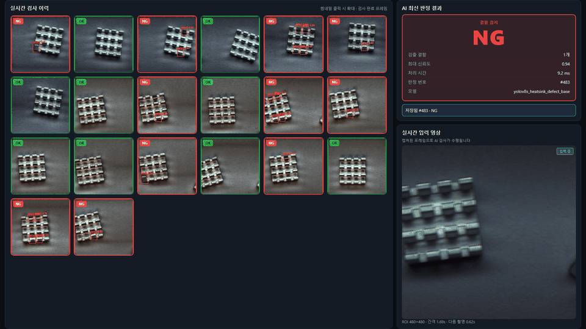
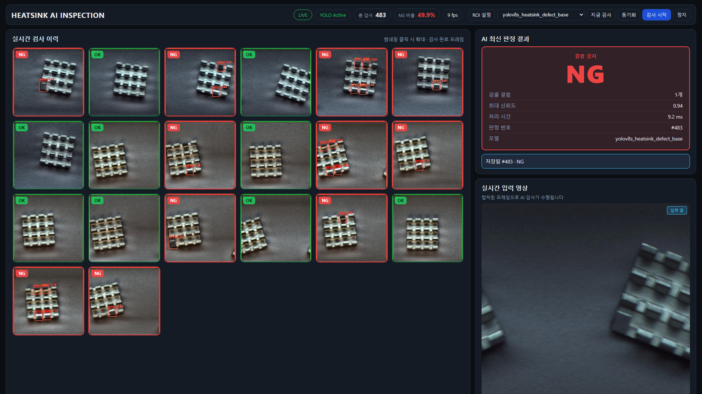
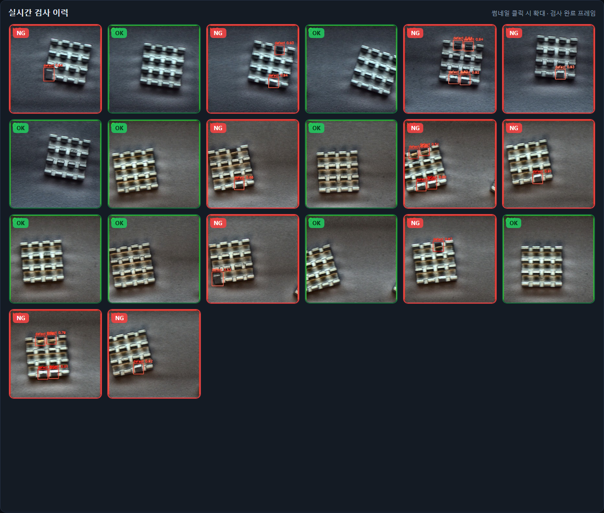
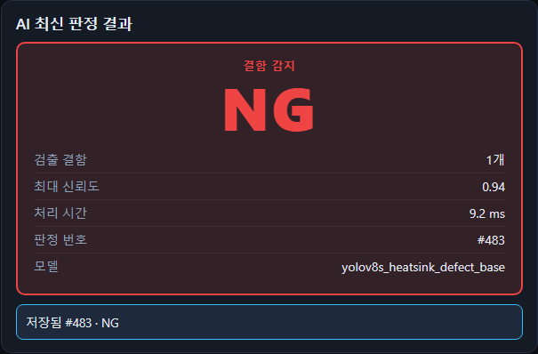
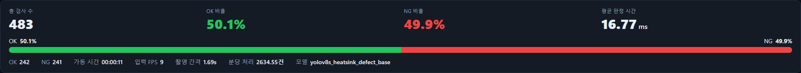
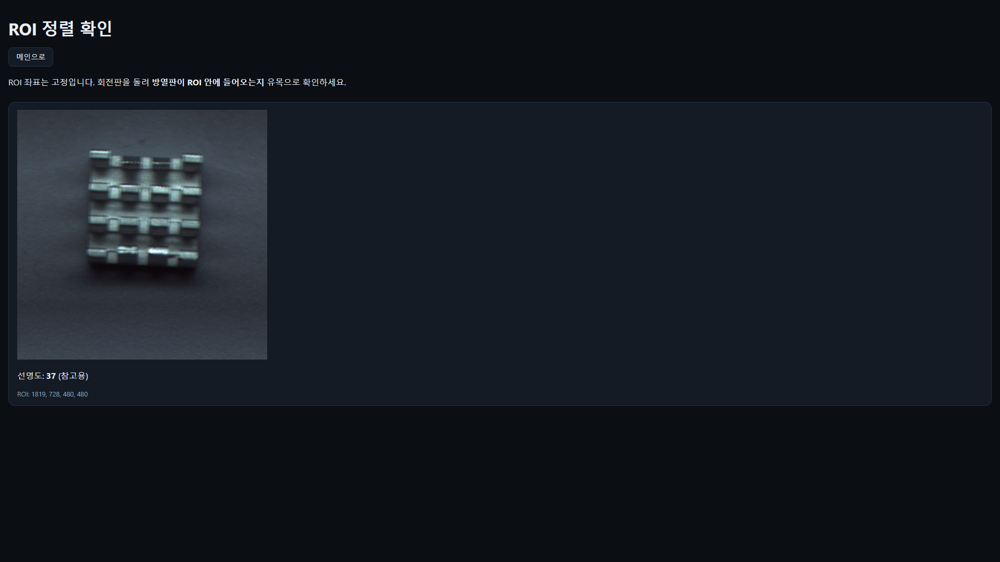
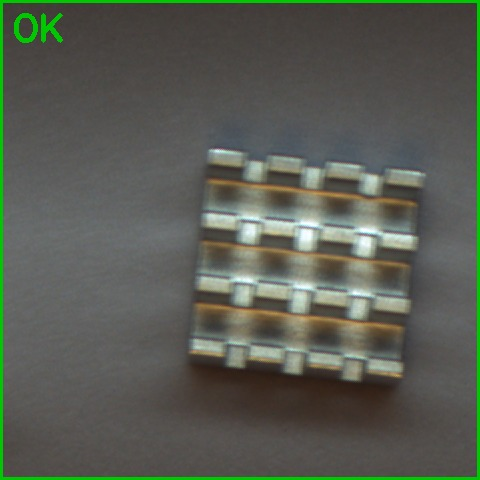
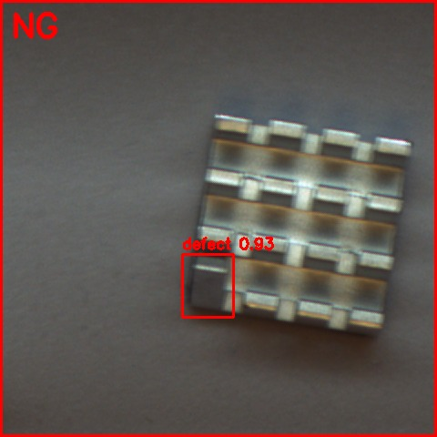
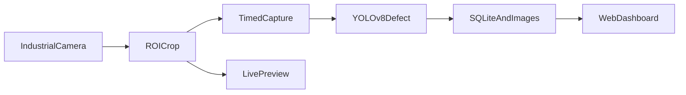

# Heatsink AI Inspection

회전 방열판 ROI 구간을 대상으로 **YOLOv8 결함 검출**과 **웹 대시보드**를 결합한 실시간 검사 시스템입니다.

## 데모

## 화면

### 메인 대시보드

검사 이력을 중심으로 OK/NG 판정·신뢰도·처리 시간을 한눈에 확인합니다.

### 검사 이력

최근 검사 결과를 그리드로 표시합니다. NG는 결함 박스가 강조됩니다.

### NG 판정 예

결함 검출 시 박스와 NG 판정이 함께 표시됩니다.

### 최신 판정

가장 최근 1건의 OK/NG를 크게 표시합니다.

### 누적 통계

총 검사 수, OK/NG 비율, 평균 판정 시간 등을 하단에서 확인합니다.

### ROI 정렬

설치 시 ROI 안에 제품이 들어오는지 확인하는 보조 화면입니다.

### 검사 결과 샘플

| OK | NG |
|:---:|:---:|
|  |  |

## 시스템 개요

## 구현 요약

- 산업용 GigE 카메라 SDK로 연속 촬영 후 **고정 ROI** 크롭
- 회전 주기에 맞춘 **소프트웨어 시간 트리거**와 커밋 구간 내 프레임 선택
- **heatsink 결함** 검출 → OK / NG 판정
- **Python** 기반 라이브 미리보기·검사 이력·통계 API
- 검사마다 **SQL DB**와와 원본/주석 이미지 파일 저장
- 대시보드는 **검사 이력·판정 결과**를 메인으로, 입력 영상은 보조 영역에 배치

## 기술 스택

- Python, OpenCV
- Ultralytics YOLOv8
- FastAPI, WebSocket
- SQLite
- Huateng MVSDK (산업용 카메라)
